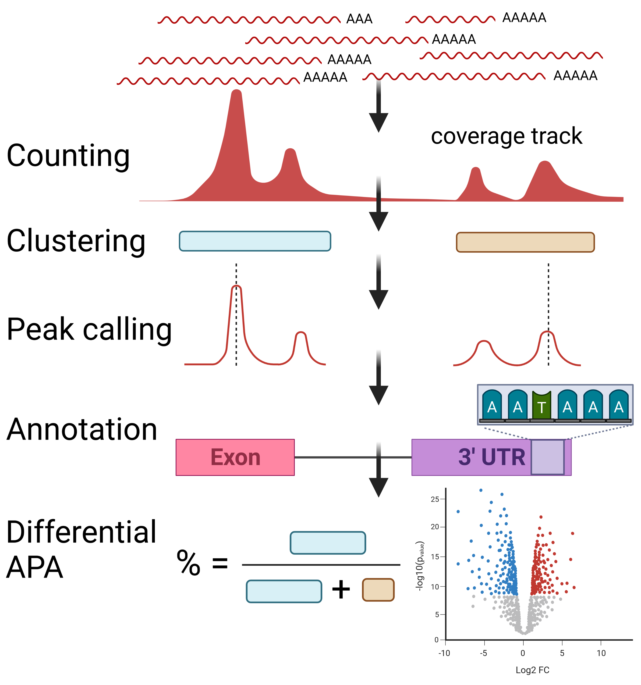

# LAPA

[](https://pypi.python.org/pypi/lapa)
[](https://github.com/mortazavilab/lapa/actions)
[](https://codecov.io/gh/mortazavilab/lapa)
[](https://lapa.readthedocs.io/en/latest/?badge=latest)

Alternative polyadenylation detection from diverse data sources such as 3'-seq, long-read and short-reads. 



## Installation

```
pip install lapa
```

## Poly(A) site calling from long-read RNA-seq or 3'-seq

```
lapa --alignment {rep1.bam},{rep2.bam},{rep3.bam} \
	--fasta {fasta} \
	--annotation {gtf} \
	--chrom_sizes {chrom_sizes} \
	--output_dir {output}
```

Argument details ([doc](https://lapa.readthedocs.io/en/tss_clustering/cli.html#lapa)):

```
$ lapa --help

Usage: lapa [OPTIONS]

  CLI interface for lapa polyA cluster calling.

Options:
  --alignment TEXT                Single or multiple bam file paths are
                                  separated with a comma.Alternatively, CSV
                                  file with columns of sample, dataset, path
                                  where the sample columns contains the name
                                  of the sample, the dataset is the group of
                                  samples replicates of each other, and path
                                  is the path of bam file.  [required]
  --fasta TEXT                    Genome reference (GENCODE or ENSEMBL fasta)
                                  [required]
  --annotation TEXT               Standart genome annotation (GENCODE or
                                  ENSEMBL gtf). GENCODE gtf file do not
                                  contains annotation for `five_prime_utr` and
                                  `three_prime_utr` so need to be corrected
                                  with `gencode_utr_fix` (see https://github.c
                                  om/MuhammedHasan/gencode_utr_fix.git).
                                  [required]
  --chrom_sizes TEXT              Chrom sizes files (can be generated with
                                  `faidx fasta -i chromsizes > chrom_sizes`)
                                  [required]
  --output_dir TEXT               Output directory of LAPA. See
                                  lapa.readthedocs.io/en/latest/output.html)
                                  for the details of the directory structure
                                  and file format.  [required]
  ...
```

Recommend setting is including all the samples with thier biosample/experimental replicates (tissue, cell line):

samples.csv
```
sample,dataset,path
ENCFF772LYG,myoblast,ENCFF772LYG.bam
ENCFF421MIL,myoblast,ENCFF421MIL.bam
ENCFF699KOR,myotube,ENCFF699KOR.bam
ENCFF731HHB,myotube,ENCFF731HHB.bam
```

then LAPA takes samples_config.csv as input:

```
lapa --alignment samples.csv \
	--fasta {fasta} \
	--annotation {gtf} \
	--chrom_sizes {chrom_sizes} \
	--output_dir {output}
 ...
```


## TSS calling from long-read RNA-seq

```
lapa_tss --alignment samples.csv \
	--fasta {fasta} \
	--annotation {gtf} \
	--chrom_sizes {chrom_sizes} \
	--output_dir {output}
```

Argument details ([doc](https://lapa.readthedocs.io/en/latest/cli.html#lapa-tss)):

```
$ lapa_tss --help

Usage: lapa_tss [OPTIONS]

  CLI interface for lapa tss cluster calling.

Options:
  --alignment TEXT                Single or multiple bam file paths are
                                  separated with a comma.Alternatively, CSV
                                  file with columns of sample, dataset, path
                                  where the sample columns contains the name
                                  of the sample, the dataset is the group of
                                  samples replicates of each other, and path
                                  is the path of bam file.  [required]
  --fasta TEXT                    Genome reference (GENCODE or ENSEMBL fasta)
                                  [required]
  --annotation TEXT               Standart genome annotation (GENCODE or
                                  ENSEMBL gtf). GENCODE gtf file do not
                                  contains annotation for `five_prime_utr` and
                                  `three_prime_utr` so need to be corrected
                                  with `gencode_utr_fix` (see https://github.c
                                  om/MuhammedHasan/gencode_utr_fix.git)
                                  [required]
  --chrom_sizes TEXT              Chrom sizes files (can be generated
                                  with)`faidx fasta -i chromsizes >
                                  chrom_sizes`)  [required]
  --output_dir TEXT               Output directory of LAPA. See
                                  lapa.readthedocs.io/en/latest/output.html)
                                  for the details of the directory structure
                                  and file format.  [required]
```


## Documentation

See the following documentation links for other features, parameters of LAPA, python api and statistical testing:

Readthedocs: https://lapa.readthedocs.io/en/latest/index.html

API reference: https://lapa.readthedocs.io/en/latest/autoapi/index.html

Colab tutorials (analysis of myoblast myotube cell differentiation): https://colab.research.google.com/drive/1QzMxCRjCk3i5_MuHzjozSRWMaJgdEdSI?usp=sharing


## Cite

If you are using LAPA on academic studies cite the following paper:

```
coming soon...
```
